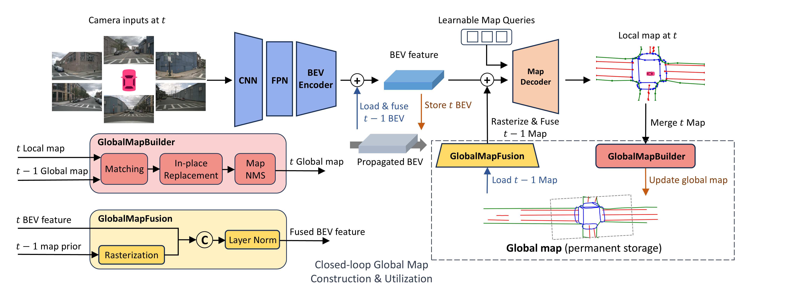

<div align="center">
  <h1>GlobalMapNet</h1>
  
  <h3>GlobalMapNet: An Online Framework for Vectorized Global HD Map Construction </h3>
  
  [](https://arxiv.org/abs/2409.10063)
  
  
</div>

## Introduction
This repository is an official implementation of GlobalMapNet.

## Updates
* **`20240927`:** Code released on Github.
* **`20240917`:** We release the revised version of our paper (v2) on arXiv.
* **`20240916`:** We release our paper on arXiv.

## Getting Started
### 1. Environment
**Step 1.** Prepare environment.

a. If you already have the correct environment (e.g. conda env or venv for StreamMapNet), just reuse it in this repository.

b. create a new conda env: Create conda environment and activate it.
```
conda create --name globalmapnet python=3.8 -y
conda activate globalmapnet
```

c. create a new venv: Create a local venv in this repository and activate it.
```
python -m venv venv
source venv/bin/activate
```

**Step 2.** Install PyTorch.

```
pip install torch==1.9.0+cu111 torchvision==0.10.0+cu111 torchaudio==0.9.0 -f https://download.pytorch.org/whl/torch_stable.html
```

**Step 3.** Install MMCV series.

```
# Install mmcv-series
pip install mmcv-full==1.6.0
pip install mmdet==2.28.2
pip install mmsegmentation==0.30.0
git clone https://github.com/open-mmlab/mmdetection3d.git
cd mmdetection3d
git checkout v1.0.0rc6 
pip install -e .
```

**Step 4.** Install other requirements.

```
pip install -r requirements.txt
```

**Step 5.** Install rasterizer.

```
cd plugin/models/heads/diff_ras/
python setup.py develop
```

### 2. Data Preparation
**Step 1.** Download [NuScenes](https://www.nuscenes.org/download) dataset to `./data/nuscenes`.

**Step 2.** Download [Argoverse2 (sensor)](https://argoverse.github.io/user-guide/getting_started.html#download-the-datasets) dataset to `./data/av2`.

**Step 3.** Generate annotation files for both datasets.

```
python tools/data_converter/nuscenes_converter.py --data-root ./data/nuscenes --dest-path cache/annotations --newsplit 
python tools/data_converter/argoverse_converter.py --data-root ./data/av2/sensor --dest-path cache/annotations --newsplit 
```

**Step 4.** (Alternatively) Generate annotation files for nuScenes dataset with ordered scenes for cross-scene evaluation.

```
python tools/data_converter/nuscenes_converter.py --data-root ./data/nuscenes --dest-path cache/annotations --newsplit --sort-scene
```

**Step 5.** Generate GT global map files for both datasets.

```
python plugin/models/globalmapnet/map_utils/nusc_gt_map.py --data-root ./data/nuscenes --root-dir ./cache/global_maps --location all
python plugin/models/globalmapnet/map_utils/argo_gt_map.py --ann_dir ./cache/annotations --data-root ./cache/global_maps --split all
```

### 3. Training and Validating
To train a model on a single GPU:

```
bash tools/dist_train.sh plugin/configs/nusc_newsplit_480_60x30_24e_global_train.py 1
```

To validate a model on a single GPU for single-scene evaluation:

```
bash tools/dist_test.sh plugin/configs/nusc_newsplit_480_60x30_24e_global_eval.py ${CHECKPOINT} 1 --eval
```

To validate a model on a single GPU for cross-scene evaluation:

```
bash tools/dist_test.sh plugin/configs/nusc_newsplit_480_60x30_24e_global_cross_scene_eval.py ${CHECKPOINT} 1 --eval
```

To test a model's inference speed:

```
python tools/benchmark.py plugin/configs/nusc_newsplit_480_60x30_24e_global_eval.py ${CHECKPOINT}
```

### 4. Visualization
To visualize a comparison of StreamMapNet, GlobalMapNet and GT:
```
python tools/visualization/vis_compare.py --globalmapnet-path ${GLOBAL_MAP_PATH} --streammapnet-path ${STREAM_MAP_PATH} --gt-path ${GT_MAP_PATH}
```

To visualize a video:
```
python tools/visualization/vis_video.py ${CONFIG} ${CHECKPOINT} ${SCENE_ID}
```

### 5. Fixes and Notices
see [fixes_and_notices](./fixes_and_notices.md) (updated 20240927)

## Results

### Single-scene comparison on NuScenes newsplit
| Range | Method | $\mathrm{AP}_{road}$ | $\mathrm{AP}_{lane}$| $\mathrm{AP}_{ped}$ | $\mathrm{mAP}$ | $\mathrm{GAP}_{road}$ | $\mathrm{GAP}_{lane}$| $\mathrm{GAP}_{ped}$ | $\mathrm{mGAP}$ | Config | Epoch | Checkpoint |
|:---:|:---:|:---:|:---:|:---:|:---:|:---:|:---:|:---:|:---:|:---:|:---:|:---:|
| $60\times 30\ m$ | StreamMapNet| 42.4 | 28.7 | 27.4 | 32.9 | 12.8 | 13.4 | 15.5 | 13.9 | [Config](./plugin/configs/nusc_newsplit_480_60x30_24e_stream.py) | 24| [ckpt](https://huggingface.co/hdtr/GlobalMapNet-public/blob/main/streammapnet_nusc_60x30.pth)|
| $60\times 30\ m$ | GlobalMapNet| 43.4 | 31.8 | 29.3 | 34.8 | 18.0 | 16.3 | 18.5 | 17.6 | [Config](./plugin/configs/nusc_newsplit_480_100x50_24e_global_eval.py) | 24| [ckpt](https://huggingface.co/hdtr/GlobalMapNet-public/blob/main/globalmapnet_nusc_100x50.pth)|
| $100\times 50\ m$ | StreamMapNet| 26.3 | 21.4 | 25.8 | 24.5 | 6.0 | 10.2 | 13.4 | 9.9 | [Config](./plugin/configs/nusc_newsplit_480_100x50_24e_stream.py) | 24| [ckpt](https://huggingface.co/hdtr/GlobalMapNet-public/blob/main/streammapnet_nusc_100x50.pth)|
| $100\times 50\ m$ | GlobalMapNet| 25.8 | 21.2 | 25.5 | 24.2 | 6.4 | 10.2 | 20.4 | 12.3 | [Config](./plugin/configs/nusc_newsplit_480_100x50_24e_global_eval.py) | 24| [ckpt](https://huggingface.co/hdtr/GlobalMapNet-public/blob/main/globalmapnet_nusc_100x50.pth)|

### Single-scene comparison on Argoverse2 newsplit
| Range | Method | $\mathrm{AP}_{road}$ | $\mathrm{AP}_{lane}$| $\mathrm{AP}_{ped}$ | $\mathrm{mAP}$ | $\mathrm{GAP}_{road}$ | $\mathrm{GAP}_{lane}$| $\mathrm{GAP}_{ped}$ | $\mathrm{mGAP}$ | Config | Epoch | Checkpoint |
|:---:|:---:|:---:|:---:|:---:|:---:|:---:|:---:|:---:|:---:|:---:|:---:|:---:|
| $60\times 30\ m$ | StreamMapNet| 64.4 | 58.5 | 58.2 | 60.4 | 33.8 | 34.2 | 27.2 | 31.7 | [Config](./plugin/configs/av2_newsplit_608_60x30_30e_stream.py) | 30| [ckpt](https://huggingface.co/hdtr/GlobalMapNet-public/blob/main/streammapnet_av2_60x30.pth)|
| $60\times 30\ m$ | GlobalMapNet| 64.8 | 58.6 | 57.5 | 60.3 | 38.8 | 34.5 | 33.7 | 35.6 | [Config](./plugin/configs/av2_newsplit_608_60x30_30e_global_eval.py) | 30| [ckpt](https://huggingface.co/hdtr/GlobalMapNet-public/blob/main/globalmapnet_av2_60x30.pth)|
| $100\times 50\ m$ | StreamMapNet| 52.7 | 49.2 | 61.1 | 54.3 | 23.0 | 25.4 | 41.3 | 29.9 | [Config](./plugin/configs/av2_newsplit_608_100x50_30e_stream.py) | 30| [ckpt](https://huggingface.co/hdtr/GlobalMapNet-public/blob/main/streammapnet_av2_100x50.pth)|
| $100\times 50\ m$ | GlobalMapNet| 52.1 | 47.5 | 61.0 | 53.5 | 25.0 | 26.3 | 44.6 | 32.0 | [Config](./plugin/configs/av2_newsplit_608_100x50_30e_global_eval.py) | 30 | [ckpt](https://huggingface.co/hdtr/GlobalMapNet-public/blob/main/globalmapnet_av2_100x50.pth)|


### Cross-scene comparison on NuScenes newsplit
| Range | Method | $\mathrm{GAP}_{road}$ | $\mathrm{GAP}_{lane}$| $\mathrm{GAP}_{ped}$ | $\mathrm{mGAP}$ | Config | Epoch | Checkpoint |
|:---:|:---:|:---:|:---:|:---:|:---:|:---:|:---:|:---:|
| $60\times 30\ m$ | StreamMapNet| 6.2 | 9.9 | 15.5 | 10.5 | [Config](./plugin/configs/nusc_newsplit_480_60x30_24e_stream_cross_scene_eval.py) | 24| see above |
| $60\times 30\ m$ | GlobalMapNet| 10.7 | 12.2 | 22.5 | 15.2 | [Config](./plugin/configs/nusc_newsplit_480_60x30_24e_global_cross_scene_eval.py) | 24| see above | 

## Acknowledgements
GlobalMapNet is based on [mmdetection3d](https://github.com/open-mmlab/mmdetection3d). It is also greatly inspired by the following outstanding contributions to the open-source community: [BEVFormer](https://github.com/fundamentalvision/BEVFormer), [HDMapNet](https://github.com/Tsinghua-MARS-Lab/HDMapNet), [MapTR](https://github.com/hustvl/MapTR) and [StreamMapNet](https://github.com/yuantianyuan01/StreamMapNet).


## Citation
```
@article{shi2024globalmapnet,
  title={GlobalMapNet: An Online Framework for Vectorized Global HD Map Construction},
  author={Shi, Anqi and Cai, Yuze and Chen, Xiangyu and Pu, Jian and Fu, Zeyu and Lu, Hong},
  journal={arXiv preprint arXiv:2409.10063},
  year={2024}
}
```